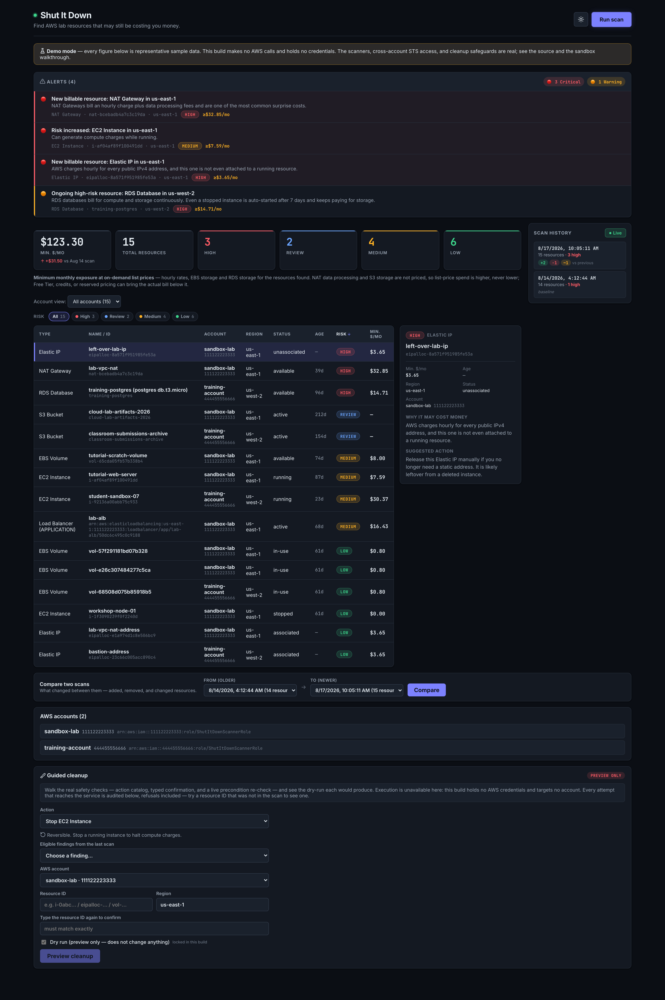
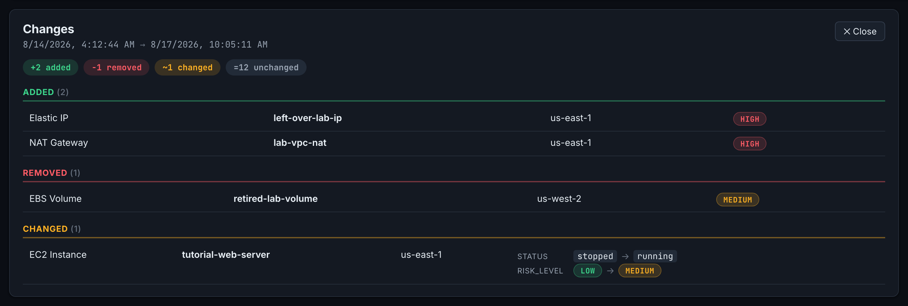
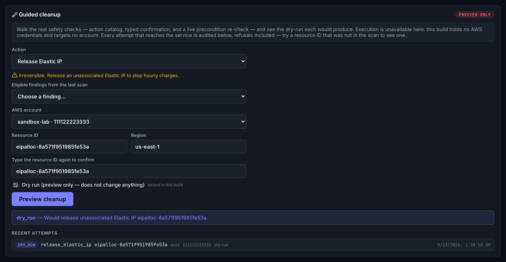
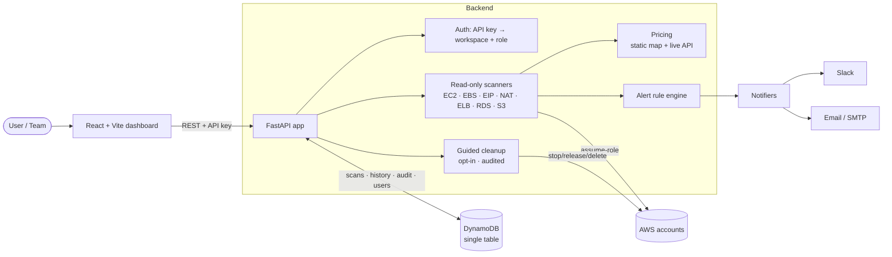

# Shut It Down

[](https://github.com/jaredf96/shut-it-down-aws/actions/workflows/ci.yml)
[](LICENSE)
[](https://dkhynvqt27enm.cloudfront.net)

**Find AWS lab resources that may still be costing you money.**

A multi-account AWS cost-exposure scanner. It reads an account (never writes),
flags the things commonly left running after a tutorial — NAT Gateways,
unattached EBS volumes, idle Elastic IPs, forgotten RDS instances — and explains
in plain English **why each one costs money, roughly how much, and what to do
about it.**



---

## 🔍 Try it

### ▶ **[Live demo](https://dkhynvqt27enm.cloudfront.net)**

Click **Run scan**. No AWS account, no credentials, nothing to configure.

Or run the same build locally:

```bash
npm --prefix frontend install && npm --prefix frontend run dev:demo
```

> **The public demo is deliberately isolated from the privileged control plane.**
> It is a static build with fixture data: it makes no AWS calls and holds no
> credentials, and the API client is *tree-shaken out of the bundle entirely* —
> there are no endpoints in it to call. That separation is the point, not a
> limitation: an app that can assume roles into cloud accounts should not be
> wired to an anonymous public page.

To run it against a **real** AWS account, see [Quickstart](#-quickstart).

---

## 📦 Status

**A production-oriented proof of concept**, not a production service. Everything
below is honest about which category it falls into.

<details open>
<summary><b>Implemented</b> — in the repo, covered by tests</summary>

- Seven read-only scanners: EC2, EBS, Elastic IPs, NAT Gateways, Load Balancers
  (ALB/NLB/Classic), RDS, S3
- Concurrent multi-region sweeps (a 17-region scan runs in ~12s)
- Cross-account access via **STS assume-role**, with per-account tagging
- Minimum monthly exposure per resource **at on-demand list prices** — static
  price map, optional live AWS Pricing API refinement. Deliberately a floor on
  that basis, not a forecast: NAT data processing and S3 storage are unpriced,
  so list-price spend is higher, never lower — while Free Tier, credits, and
  Savings Plans/Reserved discounts sit outside the model and can bring the
  actual bill below the figure
- Risk levels + plain-English cost explanation and suggested action
- Resource age from the AWS API's own launch/creation time, so a scan reads as a
  finding ("oldest running 87 days") rather than an inventory
- Regions the scan could not read — and services it could not reach at all —
  are reported, never rendered as empty ones
- Alert rule engine (new billable resource, risk increase, standing high risk)
- Scan history and diffing, persisted to DynamoDB
- Slack and email notifications
- Guarded cleanup: opt-in, admin-only, typed confirmation, dry-run default,
  live precondition re-check, full audit trail
- CloudFormation onboarding for a scanned account: one stack creates a read-only
  role trusting a single platform role ARN, gated by an external ID. The granted
  permissions are pinned against the policy published in `docs/SECURITY.md` by a
  test, so the doc and the template cannot drift apart
- Workspace-scoped backend with API-key RBAC: admin/member roles, SHA-256-hashed
  keys issued once, workspace-scoped AWS accounts with assume-role isolation, and
  audit attribution. The browser client reads `VITE_API_KEY` at build time, so the
  UI is an operator scaffold rather than a production multi-user login
- Liveness/readiness split, structured `503`s, request correlation IDs
- 219 offline backend tests + 65 frontend tests, CI, Docker, Lambda adapter
  <!-- The only exact test counts in the docs. Everywhere else describes the
       suites generically, because duplicated totals go stale one at a time. -->

</details>

<details>
<summary><b>Demonstrated publicly</b> — what the fixture demo shows</summary>

Scan workflow · risk-ranked resource table with resource age · minimum-cost
summary · account filtering · scan history · changes between scans · alert
presentation.

Team management and cleanup execution are **not** exposed in the demo.

</details>

<details>
<summary><b>Planned hardening</b> — designed, not built</summary>

OIDC authentication · fail-closed hosted account targeting · queue-based scan
workers · full Terraform deployment · a separate narrowly-scoped cleanup role
(cross-account cleanup is not possible without it — the onboarding role is
read-only on purpose) · platform-issued external IDs with a pending-enrollment
flow (`docs/DECISIONS.md` D6) · production observability.

</details>

**What the findings actually are:** a cost-exposure inventory with heuristic risk
levels, based on resource *state* rather than utilization. A running EC2 instance
is flagged without knowing whether it is busy; S3 cost is unknown without object
metrics. Adding utilization evidence and confidence scoring is on the roadmap —
it is not claimed today.

---

## 📸 Screenshots

| Dashboard | Scan comparison | Guided cleanup |
| --- | --- | --- |
|  |  |  |

_All three captured from the fixture demo, so no real account or resource
identifiers appear._

---

## 🏗️ Architecture



**Request lifecycle:** `Frontend → API (auth → workspace) → scanners (assume-role) →
pricing + alerts → persistence (DynamoDB) → notifications`.

The frontend never imports the HTTP client directly. It talks to a **scan
provider** (`frontend/src/data/`), which is either the API client or the fixture
provider, chosen at build time — that is what makes a credential-free public
demo possible without conditionals scattered through the UI.

Full write-up in **[docs/ARCHITECTURE.md](docs/ARCHITECTURE.md)**.

---

## 🚀 Quickstart

Requires **Python 3.10+** (3.12 recommended) and **Node 18+**.

```bash
# 1. Backend
cd backend
python3.12 -m venv .venv && source .venv/bin/activate   # Windows: .venv\Scripts\activate
pip install -r requirements.txt
aws configure                      # read-only credentials are enough
uvicorn app.main:app --reload --port 8000

# 2. Frontend (second terminal)
cd frontend
npm install
npm run dev
```

Open **http://localhost:5173** and click **Run scan**. API docs at
**http://localhost:8000/docs**.

With no extra config the app runs in **local mode**: no auth, no persistence,
scanning your default AWS credentials. Everything else — history,
teams, notifications, cleanup — is opt-in via the environment variables below.

### Makefile shortcuts

```bash
make               # list all targets
make install-dev   # venv + dev deps
make run           # backend on :8000
make frontend-run  # frontend on :5173
make test          # backend tests
make lint          # ruff check + format check
```

### Least-privilege IAM

The scanner needs nine read-only actions — `ec2:DescribeRegions`,
`ec2:DescribeInstances`, `ec2:DescribeVolumes`, `ec2:DescribeAddresses`,
`ec2:DescribeNatGateways`, `elasticloadbalancing:DescribeLoadBalancers`,
`rds:DescribeDBInstances`, `s3:ListAllMyBuckets`, `s3:GetBucketLocation`. The
exact policy document is in
[backend/README.md](backend/README.md#required-iam-permissions-read-only).

---

## 🐳 Docker

Runs the backend plus a local DynamoDB, so scan history works without writing
anything to real AWS. Your `~/.aws` is mounted read-only for scanning.

```bash
docker compose up --build
# backend → http://localhost:8000   (table auto-created)
```

The local DynamoDB is durable across restarts (named volume) and is built with
placeholder credentials, so persistence keeps working even when your AWS session
has expired.

---

## ✅ Testing

All tests run **fully offline** — `moto` mocks AWS, so no real credentials or
network are used.

```bash
make test                  # backend suite (pytest + moto)
make lint                  # ruff check + format check
make demo-fixtures         # regenerate demo-data/ from the real scanners

cd frontend
npm test                   # frontend suite (vitest + Testing Library)
npm run typecheck          # provider-boundary types (tsc)
```

CI runs all of it on every push, plus both frontend build profiles, a Docker
build, and a grep over the built demo bundle asserting it carries no API
endpoints and no credential handling (`make demo-bundle-check` locally). Backend coverage spans scanners, pricing, alerts, notifications,
persistence, diffing, workspaces/roles, multi-account, cleanup safety, and the
fail-closed behavior of the persistence layer.

**The provider boundary is tested as a contract.** Demo and live providers fetch
data differently, but everything above them must receive identical shapes. That
is enforced at three levels: `contract.d.ts` at compile time, a test that runs
equivalent inputs through both providers and compares the results, and a check
that `demo-data/` still validates against the real Pydantic models. The demo's
locally-computed diff is verified against output from the actual backend diff
service — a cross-language check that caught a shape mismatch which had already
crashed the compare view.

---

## ⚙️ Environment variables

Everything is **off by default** — set only what you need. Full annotated list in
[backend/.env.example](backend/.env.example).

| Variable | Purpose |
| --- | --- |
| `AWS_REGION` / `AWS_*` | AWS region + credentials (standard boto3 chain) |
| **Persistence** | |
| `DYNAMODB_TABLE_NAME` | Enables scan history / teams (set to enable) |
| `DYNAMODB_ENDPOINT_URL` | Point at local DynamoDB (e.g. `http://localhost:8001`) |
| `DYNAMODB_AUTO_CREATE` | Auto-create the table on startup (dev) |
| **Auth / workspace** | |
| `AUTH_REQUIRED` | Require an API key on every request |
| `DEFAULT_WORKSPACE_ID` | Workspace used in local mode (default `default`; `DEFAULT_TENANT_ID` is the deprecated former name) |
| **Notifications** | |
| `SLACK_WEBHOOK_URL` | Slack Incoming Webhook |
| `SMTP_HOST` / `SMTP_PORT` / `SMTP_USERNAME` / `SMTP_PASSWORD` / `SMTP_USE_TLS` | Email transport |
| `ALERT_EMAIL_FROM` / `ALERT_EMAIL_TO` | Email sender + recipients |
| `NOTIFY_ON_SCAN` / `NOTIFY_MIN_SEVERITY` | Auto-notify on scan; severity threshold |
| **Cost** | |
| `ENABLE_LIVE_PRICING` | Use the live AWS Pricing API (needs `pricing:GetProducts`) |
| **Cleanup (mutating!)** | |
| `ENABLE_CLEANUP_ACTIONS` | **Master safety switch — off by default** |

Frontend builds use `VITE_API_BASE_URL` (API mode) or `VITE_DEMO_MODE=true`
(fixture demo, see [.env.demo](frontend/.env.demo)). Note that Vite inlines every
`VITE_*` variable into public JavaScript — never put a secret in one.

---

## 🛡️ Safety around cleanup

Scanning never mutates AWS. The **only** feature that can is guided cleanup, and
it must clear **seven independent gates**:

1. **Off by default** — `POST /cleanup/execute` returns
   `403 "Cleanup actions are disabled in this environment."` unless
   `ENABLE_CLEANUP_ACTIONS=true`.
2. **Admin only** — members get `403`.
3. **Typed confirmation** — the exact resource ID must be resubmitted
   (`confirm_resource_id == resource_id`).
4. **Dry-run by default** — mutating requires an explicit `dry_run: false`.
5. **Target account ownership** — an `account_id` the workspace has not registered
   is refused with `404`. There is no fallback to the server's own credentials,
   which would run the action against the wrong account entirely.
6. **Live precondition re-check** — state is re-verified against AWS at execution
   time; the client is never trusted.
7. **Audited** — every authenticated, well-formed attempt is logged, including
   refusals and failures — even a non-admin caller or the feature flag being
   off leaves an entry. With persistence on, a real mutation is additionally preceded by a
   durable `initiated` entry; if that entry cannot be written, the action is
   refused outright (fail closed), so no mutation runs without durable
   evidence of intent. A zero-config install (no DynamoDB) keeps its records
   in the application log, like everything else it does.

The automated action set is intentionally tiny and reversible-leaning: **stop**
EC2 (never terminate), **release** unassociated Elastic IPs, **delete**
unattached EBS volumes. Terminating instances and deleting S3/RDS/NAT are
deliberately excluded and listed as unsupported.

An eighth gate sits outside the application: the scanner role is granted only
read-only IAM permissions, so even with every in-app gate passed, AWS itself
refuses the mutation. That is the intended production posture — cleanup requires
a separate, narrowly-scoped role.

More on credentials, least-privilege IAM, and assume-role:
**[docs/SECURITY.md](docs/SECURITY.md)**.

---

## 🔭 What's next

**Repository correctness** — an explicit `DEPLOYMENT_MODE` (`local` | `hosted`).
Local keeps today's zero-config behavior; hosted fails closed, rejecting missing,
unknown, or unverified account targets and never falling back to platform
credentials.

**Then** — queue-based async scans with real progress, OIDC authentication,
platform-issued external IDs behind a two-phase onboarding flow (the
CloudFormation template ships today; the ID is operator-generated, D6), full
infrastructure-as-code, and scanner intelligence (utilization evidence,
confidence scores, measured false-positive rates).

---

## 📚 Docs

| Doc | What's in it |
| --- | --- |
| [docs/ARCHITECTURE.md](docs/ARCHITECTURE.md) | Components, data model, request flow |
| [docs/SECURITY.md](docs/SECURITY.md) | Credentials, IAM, cleanup gates, production gaps |
| [docs/DEMO.md](docs/DEMO.md) | Cross-account walkthrough / recording script |
| [backend/README.md](backend/README.md) | API reference, endpoints, IAM policy |
| [deploy/README.md](deploy/README.md) | Container / Lambda deployment notes |

---

## 🧰 Tech stack

**Backend** FastAPI · boto3 · pydantic · DynamoDB · pytest + moto · ruff
**Frontend** React · Vite · plain CSS design tokens (light/dark)
**Infra** Docker · GitHub Actions · Terraform (skeleton) · Mangum (Lambda)

---

## 📁 Project structure

```
shut-it-down-aws/
├── backend/
│   ├── app/
│   │   ├── scanners/       one read-only scanner per AWS service
│   │   ├── services/       scan, diff, alerts, notify, cleanup
│   │   ├── repositories/   DynamoDB access (single table)
│   │   ├── pricing/        static price map + live Pricing API
│   │   └── notifiers/      Slack + email
│   └── tests/              offline test suite (moto)
├── frontend/
│   └── src/
│       ├── data/           scan provider: api | demo fixtures
│       ├── components/     one panel per feature
│       └── pages/
├── demo-data/              curated fixtures for the public demo
├── deploy/                 Terraform skeleton + deployment notes
└── docs/
```

---

## 📄 License

MIT — see [LICENSE](LICENSE).

---

**Development note:** This project was built with assistance from Claude Code;
all changes were reviewed and verified by the maintainer.
