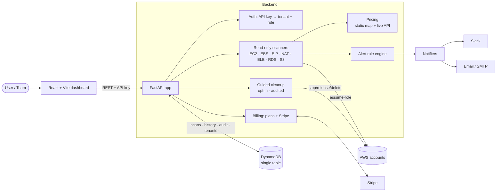

# Cloud Lab Cleanup Dashboard

<!-- After you push to GitHub, replace OWNER/REPO to activate this badge: -->
<!--  -->

**Find the AWS resources quietly draining your wallet after a tutorial — and clean them up safely.**

Cloud Lab Cleanup Dashboard scans an AWS account (read-only), flags the things
that commonly get left running after labs and courses — NAT Gateways, unattached
EBS volumes, idle Elastic IPs, forgotten RDS instances — and explains, in plain
English, **why each one costs money, roughly how much, and what to do about it.**

It started as a beginner-friendly portfolio scanner and grew into a small,
real **multi-tenant SaaS**: teams, per-account scanning, cost estimates,
Slack/email alerts, scan history & diffing, opt-in guided cleanup, and Stripe
billing — all with a test suite and a deployment path.

> 🔒 **Safe by design.** Scanning is **100% read-only**. The one mutating
> feature (guided cleanup) is **off by default** and guarded six ways over — see
> [Safety](#-safety-around-cleanup-actions). Nothing in this app deletes or
> changes AWS resources unless you explicitly opt in, confirm, and execute.

## 📦 Project status

> **SaaS MVP scaffold — not production-ready for real customer AWS
> accounts yet.**

This is a complete, tested vertical slice of a product: every feature works
end-to-end and is covered by an offline test suite (126 tests). It is built to
demonstrate cloud-engineering and product thinking, **not** to be pointed at
paying customers' AWS accounts as-is. Before that, you'd close the items in
[Production gaps](docs/SECURITY.md#production-gaps) and
[What's next](#-whats-next) — real auth (Cognito/Auth0), a hardened Terraform
deployment, rate limiting, secrets management, and webhook idempotency.

---

## 📸 Screenshots

> _Placeholder — add real screenshots/GIFs here once you run it against your account._

| Dashboard (scan + cost + alerts) | Scan history & diff | Guided cleanup (dry-run) |
| --- | --- | --- |
| _`docs/img/dashboard.png`_ | _`docs/img/history-diff.png`_ | _`docs/img/cleanup.png`_ |

Capture suggestions: the alerts panel after a scan, the "vs previous" history
badges, the diff view, and the cleanup panel mid dry-run. A 20–30s GIF of a full
scan → alert → compare → cleanup makes a great README hero.

---

## 🏗️ Architecture



**Request lifecycle:** `Frontend → API (auth → tenant) → scanners (assume-role) →
pricing + alerts → persistence (DynamoDB) → notifications → billing`.
Full write-up in **[docs/ARCHITECTURE.md](docs/ARCHITECTURE.md)**.

---

## ✨ Features

**Scanning & cost**
- Read-only scanners for **EC2, EBS, Elastic IPs, NAT Gateways, Load Balancers
  (ALB/NLB/Classic), RDS, S3**.
- Risk level per resource: `LOW` / `MEDIUM` / `HIGH` / `REVIEW`, with a
  plain-English cost explanation and suggested action.
- **Cost estimates** — `estimated_monthly_cost` per resource + a fleet-wide
  "~$X/mo" total. Static price map by default; opt-in **live AWS Pricing API**
  refinement.

**Monitoring**
- **Risk alerts** — a rule engine flags new billable resources, risk increases,
  and standing high-risk resources (severities CRITICAL/WARNING/INFO), ranked by
  spend.
- **Notifications** — deliver alerts to **Slack** and **email**, automatically
  on scan or on demand.
- **Scan history & diffing** — every scan saved (DynamoDB); browse history with
  "vs previous" badges (`+2 −1 ~3`) and compare any two scans in detail.

**Multi-tenant SaaS**
- **Tenancy + API-key auth** — every scan/alert scoped to a `tenant_id`
  (optional; off for local dev).
- **Teams & roles** — admin/member users per tenant, shared scan history.
- **Multi-account** — register AWS accounts, scan each via **STS assume-role**,
  tag every resource by account, filter per account.
- **Billing** — Free/Pro plans with per-tenant limits; **Stripe** Checkout +
  signature-verified webhooks (optional).

**Safe cleanup**
- **Guided cleanup** — opt-in, admin-only, typed confirmation, dry-run default,
  live precondition checks, full audit log. Tiny safe action set only.

**Engineering**
- 126 tests (pytest + `moto`, fully offline), `ruff` lint/format, Docker +
  Compose, Makefile, CI, Lambda adapter + Terraform skeleton.

---

## 🚀 Quickstart (local, no AWS account changes)

Requires **Python 3.10+** (3.12 recommended) and **Node 18+**.

```bash
# 1. Backend
cd backend
python3.12 -m venv .venv && source .venv/bin/activate   # Windows: .venv\Scripts\activate
pip install -r requirements.txt
aws configure                      # or export AWS_* env vars (read-only creds)
uvicorn app.main:app --reload --port 8000

# 2. Frontend (second terminal)
cd frontend
npm install
npm run dev
```

Open **http://localhost:5173** and click **Run scan**. API docs live at
**http://localhost:8000/docs**.

With no extra config the app runs in **single-tenant local mode**: no auth, no
persistence, scanning your default AWS credentials. Everything else (history,
teams, billing, cleanup) is opt-in via env vars below.

### Using the Makefile

```bash
make            # list all targets
make install-dev   # venv + dev deps
make run           # backend on :8000
make frontend-run  # frontend on :5173
make test          # backend tests
make lint          # ruff check + format check
```

---

## 🐳 Docker quickstart

Runs the backend **and** a local DynamoDB (so scan history works) with zero
writes to real AWS for persistence. Your `~/.aws` is mounted read-only for
scanning.

```bash
docker compose up --build
# backend → http://localhost:8000   (table auto-created)
```

See [docker-compose.yml](docker-compose.yml). For hosting (container or Lambda),
see **[deploy/README.md](deploy/README.md)**.

---

## 🧑‍💻 Local dev setup

```bash
cd backend
python3.12 -m venv .venv && source .venv/bin/activate
pip install -r requirements-dev.txt   # runtime + pytest, moto, ruff
```

- `.python-version` pins 3.12.3 (pyenv). The pydantic models use `X | None`
  syntax that requires **Python 3.10+** at runtime.
- The backend is a standard FastAPI app (`app.main:app`); the frontend is
  Vite/React in `frontend/`.
- Add a scanner: drop `app/scanners/<svc>_scanner.py` with a
  `scan(regions, session)` function and register it in `scanners/__init__.py`.

Deep-dive backend docs: **[backend/README.md](backend/README.md)**.

---

## ✅ Testing & quality commands

All tests run **fully offline** — `moto` mocks AWS and DynamoDB, so no real
credentials or network are used. Run from the repo root:

```bash
make test                  # backend tests (pytest + moto), 126 tests
make lint                  # ruff check + format check
make build                 # production-build the frontend (compile check)
docker compose up --build  # backend + local DynamoDB end-to-end
```

CI runs the same checks plus a frontend build and a Docker build on every push
(`.github/workflows/ci.yml`). Tests cover scanners, pricing, alerts,
notifications, persistence, diffing, tenancy/roles, multi-account, cleanup
safety, and billing.

---

## ⚙️ Environment variables

Everything is **off by default** — set only what you need. Full annotated list in
[backend/.env.example](backend/.env.example).

| Variable | Purpose |
| --- | --- |
| `AWS_REGION` / `AWS_*` | AWS region + credentials (standard boto3 chain) |
| **Persistence** | |
| `DYNAMODB_TABLE_NAME` | Enables scan history / teams / billing (set to enable) |
| `DYNAMODB_ENDPOINT_URL` | Point at local DynamoDB (e.g. `http://localhost:8001`) |
| `DYNAMODB_AUTO_CREATE` | Auto-create the table on startup (dev) |
| **Auth / tenancy** | |
| `AUTH_REQUIRED` | Require an API key on every request (SaaS mode) |
| `DEFAULT_TENANT_ID` | Tenant used in local mode (default `default`) |
| `ADMIN_TOKEN` | Gate `POST /tenants` behind this token |
| **Notifications** | |
| `SLACK_WEBHOOK_URL` | Slack Incoming Webhook |
| `SMTP_HOST` / `SMTP_PORT` / `SMTP_USERNAME` / `SMTP_PASSWORD` / `SMTP_USE_TLS` | Email transport |
| `ALERT_EMAIL_FROM` / `ALERT_EMAIL_TO` | Email sender + recipients |
| `NOTIFY_ON_SCAN` / `NOTIFY_MIN_SEVERITY` | Auto-notify on scan; severity threshold |
| **Cost** | |
| `ENABLE_LIVE_PRICING` | Use the live AWS Pricing API (needs `pricing:GetProducts`) |
| **Cleanup (mutating!)** | |
| `ENABLE_CLEANUP_ACTIONS` | **Master safety switch — off by default** |
| **Billing** | |
| `STRIPE_SECRET_KEY` / `STRIPE_PRICE_ID` / `STRIPE_WEBHOOK_SECRET` | Stripe billing |
| `BILLING_SUCCESS_URL` / `BILLING_CANCEL_URL` | Checkout redirect URLs |

---

## 🛡️ Safety around cleanup actions

The scanner never mutates AWS. The **only** feature that can is guided cleanup,
and it must clear **six independent gates**:

1. **Off by default** — `POST /cleanup/execute` returns
   `403 "Cleanup actions are disabled in this environment."` unless
   `ENABLE_CLEANUP_ACTIONS=true`.
2. **Admin only** — members get `403`.
3. **Typed confirmation** — you must submit the exact resource ID
   (`confirm_resource_id == resource_id`).
4. **Dry-run by default** — you must explicitly send `dry_run: false` to mutate.
5. **Live precondition re-check** — state is verified against AWS at execution
   time (an EIP must still be unassociated; an EBS volume still unattached).
6. **Audited** — every attempt (refused, failed, dry-run, executed) is logged.

The automated action set is intentionally tiny and reversible-leaning: **Stop**
EC2 (not terminate), **release** unassociated Elastic IPs, **delete** unattached
EBS volumes. Terminating EC2 and deleting S3/RDS/NAT are **not** automated.
Details: [docs/SECURITY.md](docs/SECURITY.md) ·
[backend/README.md](backend/README.md#guided-cleanup-the-only-mutating-feature).

More on credentials, least-privilege IAM, assume-role, and webhook verification:
**[docs/SECURITY.md](docs/SECURITY.md)**.

---

## 💼 SaaS / product positioning

**Who it's for:** students and bootcamps burning credits on forgotten lab
resources; instructors running AWS classrooms; small teams who want a dead-simple
"what's costing us money and can we kill it" view without a heavyweight FinOps
platform.

**Why it's different:** opinionated and *safe* — it explains risk in plain
English, estimates spend, and treats deletion as a careful, audited checklist
rather than one-click automation. It's multi-tenant and classroom-ready out of
the box (per-student AWS accounts, shared dashboards, roles).

**Monetization:** Free/Pro plans gated by per-tenant limits (AWS accounts + team
members), billed through Stripe. The plan model and webhook handling are built
and tested; wiring a real Stripe product is a config step.

**Deliberately *not*:** a full FinOps/CSPM suite. Cost estimates are credible
ballparks, scanners cover the common lab offenders, and cleanup is intentionally
conservative. See [Production gaps](docs/SECURITY.md#production-gaps) for what
you'd harden before charging real money.

A guided **[demo script](docs/DEMO.md)** walks the whole story in ~10 minutes.

---

## 🔭 What's next

The roadmap that took this from a scanner to a SaaS MVP is complete; the next
tranche is about making it production-grade and broadening coverage:

- **Production Terraform deployment** — flesh out `deploy/terraform/` with the
  Lambda function (container image), API Gateway / Function URL, IAM role, and
  remote state.
- **Cognito / Auth0 authentication** — replace long-lived API keys with managed
  auth, real sign-up, and session/JWT handling.
- **Per-tenant notification channels** — store each tenant's Slack webhook /
  email targets instead of a single global config.
- **Alert deduplication and snooze** — only notify on *new* or *escalated*
  alerts, with acknowledge/snooze, before enabling `NOTIFY_ON_SCAN` in prod.
- **More scanners** — Lambda functions, ECS/EKS, unused snapshots, idle log
  groups, Elastic Beanstalk environments.
- **Cleanup approval workflows** — a second approver and soft-delete/snapshot-
  first for destructive actions.
- **Public landing page** — marketing site, pricing page, and self-serve sign-up
  funneling into Stripe Checkout.

See also [Production gaps](docs/SECURITY.md#production-gaps) for the security
hardening checklist.

---

## 📚 Docs

- **[docs/ARCHITECTURE.md](docs/ARCHITECTURE.md)** — components, data model, request flow
- **[docs/SECURITY.md](docs/SECURITY.md)** — credentials, IAM, cleanup safety, webhooks, production gaps
- **[docs/DEMO.md](docs/DEMO.md)** — step-by-step demo script
- **[backend/README.md](backend/README.md)** — API reference, every feature in depth
- **[deploy/README.md](deploy/README.md)** — hosting (container / Lambda) + Stripe setup

## Tech stack

**Backend:** Python 3.12 · FastAPI · boto3 · pydantic · DynamoDB (single-table) ·
Stripe · Mangum (Lambda) · pytest + moto · ruff
**Frontend:** React 18 · Vite
**Ops:** Docker + Compose · Makefile · GitHub Actions · Terraform (skeleton)

## Project structure

```
cloud-lab-cleanup-dashboard/
  backend/
    app/
      main.py              FastAPI app + routes
      config.py            env-driven settings (all feature toggles)
      auth.py              API key → principal (tenant + user + role)
      aws/session.py       default + assume-role boto3 sessions
      scanners/            one read-only scanner per AWS service
      models/              Resource, Alert, Account, Cleanup
      services/            scan, diff, history, alerts, notification,
                           multi_account, cleanup, billing
      pricing/             static + live AWS Pricing estimates
      notifiers/           Slack + email delivery
      repositories/        scan, tenant, user, account, audit, billing
      lambda_handler.py    AWS Lambda entrypoint (Mangum)
    scripts/create_table.py  idempotent DynamoDB table creation
  deploy/                  Terraform skeleton + deployment guide
  docs/                    architecture, security, demo
  frontend/src/
    api/client.js          backend API client
    components/            Resource/Alerts/History/Diff/Accounts/Users/
                           Cleanup/Billing panels
    pages/Dashboard.jsx    main screen
  Makefile · docker-compose.yml · README.md
```
