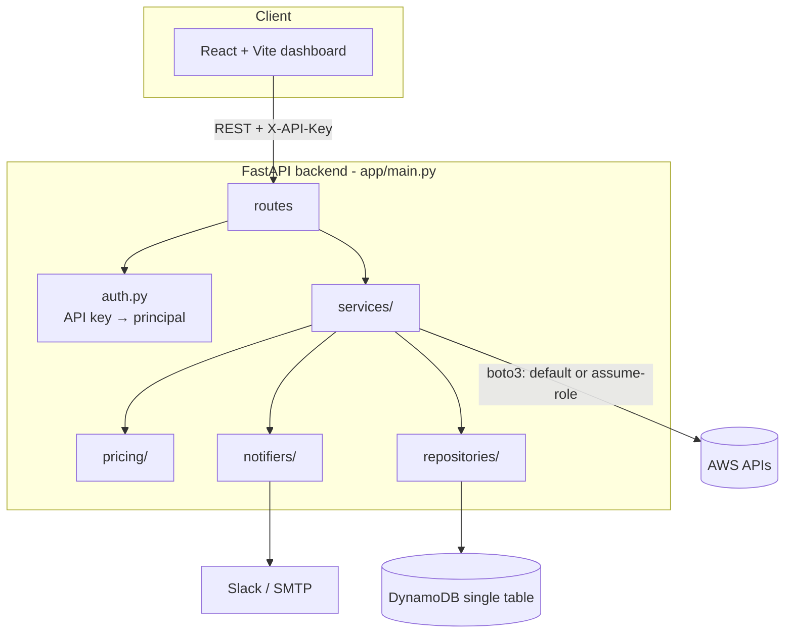
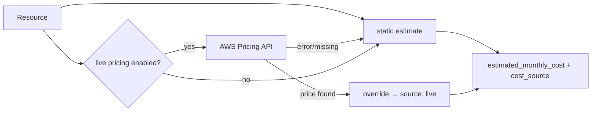
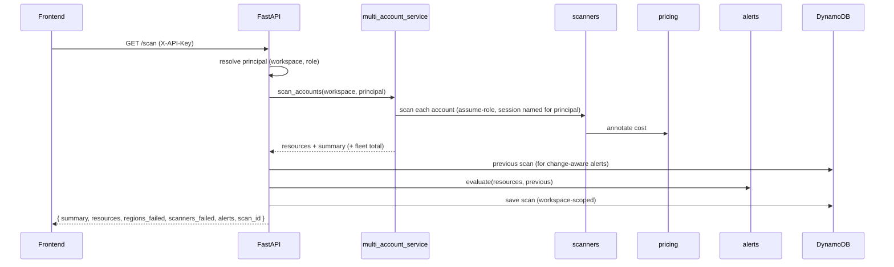

# Architecture

How Shut It Down is put together: the components, how a
request flows through them, and how data is stored.

## Two deployment surfaces, one codebase

The application can assume IAM roles into AWS accounts. That capability must not
sit behind an anonymous public page, so the project ships as **two separate
deployments** built from the same source:

| Surface | Data source | Credentials | Reachability |
| --- | --- | --- | --- |
| **Public demo** | `demo-data/` fixtures | none | static files; no route to the API |
| **Authenticated app** | live API + AWS | scanner role via STS | private |

The frontend never imports the HTTP client directly. Components depend on a
**scan provider** (`frontend/src/data/`), and the build selects one:

```
scanProvider.js  ──selects at build time (VITE_DEMO_MODE)──┐
                                                            ├─► apiScanProvider  → api/client.js → API
                                                            └─► demoScanProvider → demo-data/*.json
```

Two consequences worth noting:

- Because the mode is a build-time constant, the bundler **tree-shakes the API
  client out of the demo bundle entirely** — the published demo contains no
  endpoints and no credential handling, not merely a disabled path.
- Providers publish a `capabilities` map (`liveScan`, `history`,
  `accountsAdmin`, `team`, `cleanupPreview`, `cleanupExecute`), so panels ask *"may I
  offer this?"* rather than testing for demo mode. Adding a surface means adding
  a provider, not threading conditionals through the component tree.

Isolation is therefore a property of the deployment and of the artifact, not of
a runtime flag.

## High-level



## The end-to-end flow

```
Frontend → API → scanners → persistence → alerts → notifications
```

1. **Frontend** (`frontend/src`) calls the API with `fetch`. In a shared
   deployment it sends an `X-API-Key` header (`VITE_API_KEY`); locally it sends
   nothing.
2. **API / auth** (`app/main.py`, `app/auth.py`) resolves the request to a
   **principal** `{workspace_id, user_id, role}`. No key + `AUTH_REQUIRED` off →
   an admin "local" user of the default workspace. A key → the stored principal.
   `require_admin` guards mutating/management routes.
3. **Scanners** (`app/scanners/`, orchestrated by `app/services/scan_service.py`
   and `multi_account_service.py`) call read-only AWS APIs. Single-account uses
   the server's credentials; multi-account assumes each registered account's
   role via STS (`app/aws/session.py`) and tags resources by account.
4. **Pricing** (`app/pricing/`) stamps each resource with an
   `estimated_monthly_cost` — static map by default, live AWS Pricing API when
   enabled (with static fallback). It is a **floor**: unpriced dimensions (NAT
   data processing, S3 storage) can only push the real bill up.
5. **Persistence** (`app/repositories/`) saves each scan to DynamoDB, scoped by
   workspace, and powers history, "vs previous" deltas, and diffing.
6. **Alerts** (`app/services/alerts_service.py`) derive notification-ready
   `Alert` objects from the scan + the previous scan, ranked by spend.
7. **Notifications** (`app/notifiers/`, `notification_service.py`) deliver alerts
   to Slack/email — automatically on scan or via `POST /notify`.

Cleanup (`app/services/cleanup_service.py`) is a separate, opt-in, audited write
path — see [SECURITY.md](SECURITY.md).

## Layers & responsibilities

| Layer | Modules | Responsibility |
| --- | --- | --- |
| **Routes** | `app/main.py` | HTTP surface, status codes, dependency wiring |
| **Middleware** | `app/main.py` → `ErrorEnvelopeMiddleware` | Correlation id on every response; any escaped exception becomes JSON *inside* the CORS layer |
| **Auth** | `app/auth.py` | API key → principal; `get_current_workspace`, `require_admin` |
| **Services** | `app/services/` | Orchestration: scan, diff, history, alerts, notification, multi_account, cleanup |
| **Scanners** | `app/scanners/` | One read-only `scan(regions=None, session=None, failed_regions=None) -> list[Resource]` per AWS service |
| **Pricing** | `app/pricing/` | Static price map + live Pricing API + estimator |
| **Notifiers** | `app/notifiers/` | Slack + email channels (`format` vs `send`) |
| **Repositories** | `app/repositories/` | DynamoDB access, one module per record family |
| **Models** | `app/models/` | Pydantic shapes: Resource, Alert, Account, Cleanup |
| **AWS sessions** | `app/aws/session.py` | Default + assume-role boto3 sessions |
| **Sessions/Lambda** | `app/lambda_handler.py` | Mangum adapter for Lambda |

The envelope is the client's error contract, not just a log line.
`frontend/src/api/client.js` unpacks it into an `ApiError` and renders
`detail` as the message — so a sentence written in a service is the sentence a
user reads, and `backend/README.md` § What a failure looks like says what may
go in one.

Design rule: **scanners are account-agnostic and read-only**; everything
workspace-aware (saving, listing, diffing) lives in services/repositories and
threads an explicit `workspace_id`. This kept the original single-account
scanner code untouched as workspaces and multi-account were added.

## Scanner contract

Every scanner exposes:

```python
def scan(regions=None, session=None, failed_regions=None) -> list[Resource]: ...
```

- `regions=None` → auto-discover (`app/utils/aws_regions.py`).
- `session=None` → default credentials; otherwise an assumed-role session.
- `failed_regions` → optional `dict` filled with `region -> reason` for regions
  the sweep could not read, surfaced as `regions_failed` on the scan result.
- A scanner that cannot run at all **raises**; `scan_service` catches it, keeps
  the other scanners going, and reports it under `scanners_failed`. Returning
  an empty list instead would report "could not see" as "nothing there" — the
  same failure `failed_regions` exists to prevent, one level up. This is the
  only signal S3 has: it is global, so no region is at fault.
- Registered in `app/scanners/__init__.py` (`SCANNERS` dict, with a display
  name in `SCANNER_LABELS`), so the service iterates uniformly. Scanners are
  reached only through `GET /scan`.

The per-region body goes in a `_scan_region(region, session)` helper, and `scan`
returns:

```python
return scan_regions(
    lambda r: _scan_region(r, session), regions, session, failed_regions=failed_regions
)
```

Build clients inside the helper with `make_client` (see `app/utils/concurrency.py`
— it lock-guards botocore's client factory, which is not safe to call
concurrently on a shared Session). Let per-region errors propagate out of
`_scan_region` so `scan_regions` can record them; catching them there reports an
unreadable region as an empty one.

Each `Resource` carries: type, id, name, region, status, **risk level**,
plain-English cost note, suggested action, optional `account_id`/`account_label`,
`created_at` (the API's own launch/creation time, null where it reports none),
type-specific `details` (instance type, volume size, …), and the monthly cost
floor.

## Data model — single DynamoDB table

One table, `pk` (HASH) + `sk` (RANGE), `PAY_PER_REQUEST`. Record families are
separated by **partition-key prefixes**, so everything is workspace-scoped and a
single `Query` answers each access pattern (no GSIs).

The prefixes below say `TENANT#`/`ACCOUNTS#` while the logical model says
*workspace*. That mismatch is deliberate: the rename (D3) stopped at the storage
boundary so no self-hosted install needs a data migration. The one stored
`tenant_id` attribute that reaches a caller is translated in `user_repository`.

| Record | `pk` | `sk` | Notes |
| --- | --- | --- | --- |
| Scan run | `TENANT#<workspace>` | `<scan_id>` | `scan_id = <ISO-8601 UTC>_<uuid8>` (time-sortable) |
| API key → principal | `APIKEY#<sha256(key)>` | `#` | only the key **hash** is stored; stores the workspace under the legacy attribute `tenant_id` |
| User | `USERS#<workspace>` | `<user_id>` | name, role, key hash (for revocation) |
| AWS account | `ACCOUNTS#<workspace>` | `<account_id>` | role ARN, external id, regions |
| Audit entry | `AUDIT#<workspace>` | `<ISO>_<uuid8>` | every cleanup attempt |
| ~~Tenant meta~~ | `TENANTMETA#<workspace>` | `#` | **RETIRED** — its owner was deleted in D2; nothing reads or writes it, and existing rows are deliberately left in place (D3) |

Key properties:
- **Workspace isolation** is structural — a workspace can only ever `Query` its
  own partitions.
- **Time-sortable sort keys** mean "newest first" is `ScanIndexForward=False`
  with no secondary index. History deltas fetch `limit + 1` so even the oldest
  row on a page has a predecessor to diff against.
- Bulk scan payloads are stored zlib-compressed; lightweight metadata
  (`created_at`, `resource_count`, `summary_json`) stays native so the history
  list projects cheaply and a saved scan stays legible in the console.
- **Every repository read follows `LastEvaluatedKey`**, via
  `dynamo.query_items`. A Query is capped at 1 MB of items *read* — before any
  `ProjectionExpression` — and a short page returned as a complete answer is
  the same failure the scanner contract forbids by name.

`app/repositories/dynamo.py` is the shared table accessor + idempotent
`ensure_table()`. Persistence is **optional**: with no `DYNAMODB_TABLE_NAME`,
every repository call is a safe no-op and history/teams endpoints return `503`,
while scanning still works.

## Cost floors



The static map (`app/pricing/static_prices.py`) is the always-available
baseline. `app/pricing/live_prices.py` adds live lookups for a small set of
dimensions (NAT, EBS today) and is best-effort — any failure falls back to
static. New types are added to live pricing incrementally; the service prefers
live automatically when present.

Both paths price fixed hourly rates, EBS GB-month storage and RDS allocated
storage, so the result is still a lower bound. NAT data processing and S3
storage would need byte counts from CloudWatch, and the IAM to read them —
a wider policy than a read-only scanner should carry, so they stay unpriced.

## Alerts → notifications

`alerts_service.evaluate(resources, previous_resources)` produces at most one
`Alert` per resource (highest-priority rule wins) and ranks by severity then
spend. `notification_service.notify(alerts)` filters by `NOTIFY_MIN_SEVERITY`
and dispatches to each configured notifier; a failing channel is isolated and
reported, never breaking the others. The `Alert` shape is the same object the
dashboard renders and the notifiers send — one contract, three consumers.

## Request → response example (`GET /scan`)



## Deployment shape

The same FastAPI app runs three ways:
- **Local** — `uvicorn app.main:app`.
- **Container** — `backend/Dockerfile` (ECS / App Runner / Fargate).
- **Lambda** — `app/lambda_handler.py` (Mangum) behind API Gateway / Function URL.

State lives entirely in the one DynamoDB table; the app is otherwise stateless,
so it scales horizontally. See [deploy/README.md](../deploy/README.md) and the
Terraform skeleton in `deploy/terraform/`.
